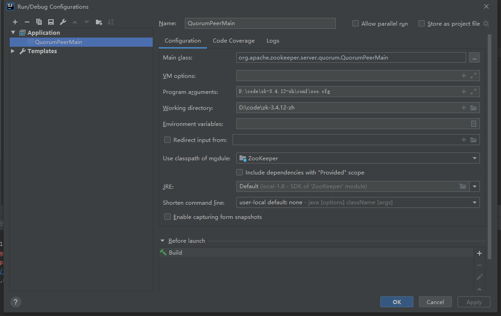

# zk-3.4.12-zh zookeeper中文注释源码阅读

## 对应imooc课程

- [Zookeeper源码分析，剖析源码掌握框架原理 关注细节理解工作业务](https://coding.imooc.com/class/361.html)

## zk原项目地址

- [https://github.com/apache/zookeeper](https://github.com/apache/zookeeper)

## 安装顺序

1. 安装ant
2. 执行`ant eclipse`
3. 选择`.project`导入idea, 开始撸源码
4. 失败一般都是网络问题，麻烦多试几次
5. 加油

## 源代码下载地址

- [http://archive.apache.org/dist/zookeeper/zookeeper-3.4.12/](http://archive.apache.org/dist/zookeeper/zookeeper-3.4.12/)

## 启动

- link: `org.apache.zookeeper.server.quorum`
- program arguments: `D:\code\zk-3.4.12-zh\conf\zoo.cfg`
- 添加了resources目录以及log4j.properties

以下原文----
For the latest information about ZooKeeper, please visit our website at:

   http://zookeeper.apache.org/

and our wiki, at:

   https://cwiki.apache.org/confluence/display/ZOOKEEPER

Full documentation for this release can also be found in docs/index.html

---------------------------
Packaging/release artifacts

The release artifact contains the following jar file at the toplevel:

zookeeper-<version>.jar         - legacy jar file which contains all classes
                                  and source files. Prior to version 3.3.0 this
                                  was the only jar file available. It has the 
                                  benefit of having the source included (for
                                  debugging purposes) however is also larger as
                                  a result

The release artifact contains the following jar files in "dist-maven" directory:

zookeeper-<version>.jar         - bin (binary) jar - contains only class (*.class) files
zookeeper-<version>-sources.jar - contains only src (*.java) files
zookeeper-<version>-javadoc.jar - contains only javadoc files

These bin/src/javadoc jars were added specifically to support Maven/Ivy which have 
the ability to pull these down automatically as part of your build process. 
The content of the legacy jar and the bin+sources jar are the same.

As of version 3.3.0 bin/sources/javadoc jars contained in dist-maven directory
are deployed to the Apache Maven repository after the release has been accepted
by Apache:
  http://people.apache.org/repo/m2-ibiblio-rsync-repository/
